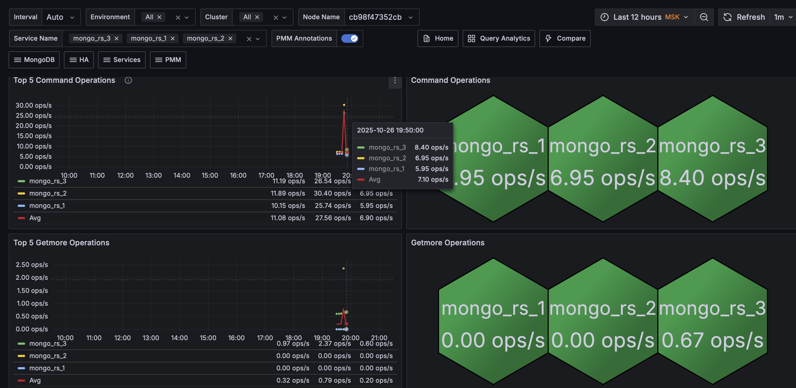
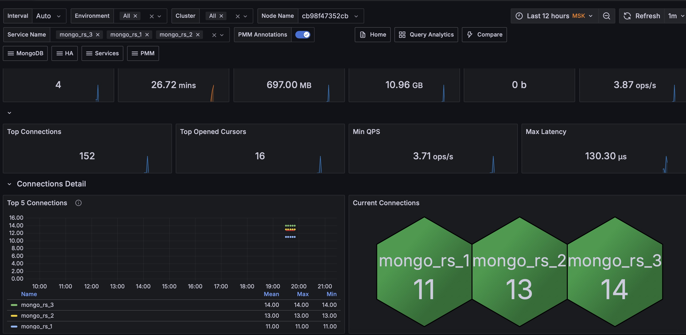
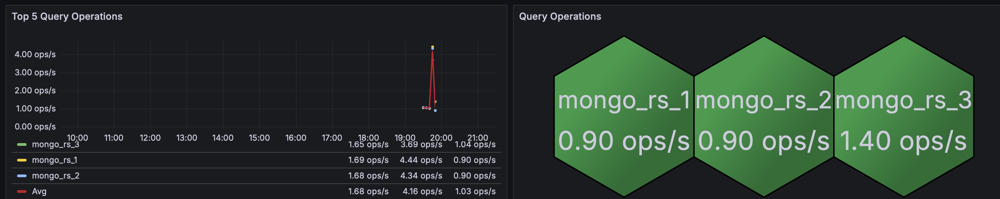

1. Развернуть ВМ (Linux) с MongoDB (у вас ест ВМ в ВБ, любой другой способ, в тч.. докер)

Запускаем Replica Set
```
$ docker compose up mongodb-rs-init
WARN[0000] /lessons/mongodb/docker-compose.yml: the attribute `version` is obsolete, it will be ignored, please remove it to avoid potential confusion 
WARN[0000] Found orphan containers ([mongodb-rs103 mongodb-rs102 mongodb-rs101 mongodb-mongos minio mongodb-rs201 mongodb-rs203 mongodb-rs202 mongodb-cs101 mongodb-cs102 mongodb-cs103 rs-1-init cs-init rs-2-init mongodb mongodb-4]) for this project. If you removed or renamed this service in your compose file, you can run this command with the --remove-orphans flag to clean it up. 
[+] Running 4/4
 ✔ Container mongodb-rs2  Created                                                                                      0.1s 
 ✔ Container mongodb-rs1  Created                                                                                      0.1s 
 ✔ Container mongodb-rs3  Created                                                                                      0.1s 
 ✔ Container rs-init      Created                                                                                      0.1s 
Attaching to rs-init
rs-init  | MongoNetworkError: connect ECONNREFUSED 172.20.0.2:27001
rs-init  | waited for connection
rs-init  | {
rs-init  |   ok: 1,
rs-init  |   '$clusterTime': {
rs-init  |     clusterTime: Timestamp({ t: 1761494500, i: 1 }),
rs-init  |     signature: {
rs-init  |       hash: Binary.createFromBase64('AAAAAAAAAAAAAAAAAAAAAAAAAAA=', 0),
rs-init  |       keyId: Long('0')
rs-init  |     }
rs-init  |   },
rs-init  |   operationTime: Timestamp({ t: 1761494500, i: 1 })
rs-init  | }
rs-init exited with code 0
```

Зайдем в контейнер
```
$ docker exec -it mongodb-rs1 bash
[mongodb@a0083871432c /]$ mongosh --port 27001
Current Mongosh Log ID:p68fe462f2502b01ae034de76ble Watch
Connecting to:          mongodb://127.0.0.1:27001/?directConnection=true&serverSelectionTimeoutMS=2000&appName=mongosh+2.3.2
Using MongoDB:          8.0.4-1
Using Mongosh:          2.3.2

For mongosh info see: https://www.mongodb.com/docs/mongodb-shell/


To help improve our products, anonymous usage data is collected and sent to MongoDB periodically (https://www.mongodb.com/legal/privacy-policy).
You can opt-out by running the disableTelemetry() command.

------
   The server generated these startup warnings when booting
   2025-10-26T16:01:34.984+00:00: Access control is not enabled for the database. Read and write access to data and configuration is unrestricted. You can use percona-server-mongodb-enable-auth.sh to fix it
   2025-10-26T16:01:34.984+00:00: For customers running the current memory allocator, we suggest changing the contents of the following sysfsFile
   2025-10-26T16:01:34.984+00:00: We suggest setting the contents of sysfsFile to 0.
   2025-10-26T16:01:34.984+00:00: vm.max_map_count is too low
   2025-10-26T16:01:34.984+00:00: We suggest setting swappiness to 0 or 1, as swapping can cause performance problems.
------

RS1 [direct: secondary] test> 

RS1 [direct: secondary] test> rs.status()
{
  set: 'RS1',
  date: ISODate('2025-10-26T16:03:00.502Z'),
  myState: 2,
  term: Long('1'),
  syncSourceHost: 'mongodb-rs3:27003',
  syncSourceId: 2,
  heartbeatIntervalMillis: Long('2000'),
  majorityVoteCount: 2,
  writeMajorityCount: 2,
  votingMembersCount: 3,
  writableVotingMembersCount: 3,
  optimes: {
    lastCommittedOpTime: { ts: Timestamp({ t: 1761494570, i: 1 }), t: Long('1') },
    lastCommittedWallTime: ISODate('2025-10-26T16:02:50.945Z'),
    readConcernMajorityOpTime: { ts: Timestamp({ t: 1761494570, i: 1 }), t: Long('1') },
    appliedOpTime: { ts: Timestamp({ t: 1761494570, i: 1 }), t: Long('1') },
    durableOpTime: { ts: Timestamp({ t: 1761494570, i: 1 }), t: Long('1') },
    writtenOpTime: { ts: Timestamp({ t: 1761494570, i: 1 }), t: Long('1') },
    lastAppliedWallTime: ISODate('2025-10-26T16:02:50.945Z'),
    lastDurableWallTime: ISODate('2025-10-26T16:02:50.945Z'),
    lastWrittenWallTime: ISODate('2025-10-26T16:02:50.945Z')
  },
  lastStableRecoveryTimestamp: Timestamp({ t: 1761494550, i: 1 }),
  electionParticipantMetrics: {
    votedForCandidate: true,
    electionTerm: Long('1'),
    lastVoteDate: ISODate('2025-10-26T16:01:50.865Z'),
    electionCandidateMemberId: 2,
    voteReason: '',
    lastWrittenOpTimeAtElection: { ts: Timestamp({ t: 1761494500, i: 1 }), t: Long('-1') },
    maxWrittenOpTimeInSet: { ts: Timestamp({ t: 1761494500, i: 1 }), t: Long('-1') },
    lastAppliedOpTimeAtElection: { ts: Timestamp({ t: 1761494500, i: 1 }), t: Long('-1') },
    maxAppliedOpTimeInSet: { ts: Timestamp({ t: 1761494500, i: 1 }), t: Long('-1') },
    priorityAtElection: 1,
    newTermStartDate: ISODate('2025-10-26T16:01:50.906Z'),
    newTermAppliedDate: ISODate('2025-10-26T16:01:51.445Z')
  },
  members: [
    {
      _id: 0,
      name: 'mongodb-rs1:27001',
      health: 1,
      state: 2,
      stateStr: 'SECONDARY',
      uptime: 86,
      optime: { ts: Timestamp({ t: 1761494570, i: 1 }), t: Long('1') },
      optimeDate: ISODate('2025-10-26T16:02:50.000Z'),
      optimeWritten: { ts: Timestamp({ t: 1761494570, i: 1 }), t: Long('1') },
      optimeWrittenDate: ISODate('2025-10-26T16:02:50.000Z'),
      lastAppliedWallTime: ISODate('2025-10-26T16:02:50.945Z'),
      lastDurableWallTime: ISODate('2025-10-26T16:02:50.945Z'),
      lastWrittenWallTime: ISODate('2025-10-26T16:02:50.945Z'),
      syncSourceHost: 'mongodb-rs3:27003',
      syncSourceId: 2,
      infoMessage: '',
      configVersion: 1,
      configTerm: 1,
      self: true,
      lastHeartbeatMessage: ''
    },
    {
      _id: 1,
      name: 'mongodb-rs2:27002',
      health: 1,
      state: 2,
      stateStr: 'SECONDARY',
      uptime: 80,
      optime: { ts: Timestamp({ t: 1761494570, i: 1 }), t: Long('1') },
      optimeDurable: { ts: Timestamp({ t: 1761494570, i: 1 }), t: Long('1') },
      optimeWritten: { ts: Timestamp({ t: 1761494570, i: 1 }), t: Long('1') },
      optimeDate: ISODate('2025-10-26T16:02:50.000Z'),
      optimeDurableDate: ISODate('2025-10-26T16:02:50.000Z'),
      optimeWrittenDate: ISODate('2025-10-26T16:02:50.000Z'),
      lastAppliedWallTime: ISODate('2025-10-26T16:02:50.945Z'),
      lastDurableWallTime: ISODate('2025-10-26T16:02:50.945Z'),
      lastWrittenWallTime: ISODate('2025-10-26T16:02:50.945Z'),
      lastHeartbeat: ISODate('2025-10-26T16:02:59.484Z'),
      lastHeartbeatRecv: ISODate('2025-10-26T16:02:59.975Z'),
      pingMs: Long('0'),
      lastHeartbeatMessage: '',
      syncSourceHost: 'mongodb-rs3:27003',
      syncSourceId: 2,
      infoMessage: '',
      configVersion: 1,
      configTerm: 1
    },
    {
      _id: 2,
      name: 'mongodb-rs3:27003',
      health: 1,
      state: 1,
      stateStr: 'PRIMARY',
      uptime: 80,
      optime: { ts: Timestamp({ t: 1761494570, i: 1 }), t: Long('1') },
      optimeDurable: { ts: Timestamp({ t: 1761494570, i: 1 }), t: Long('1') },
      optimeWritten: { ts: Timestamp({ t: 1761494570, i: 1 }), t: Long('1') },
      optimeDate: ISODate('2025-10-26T16:02:50.000Z'),
      optimeDurableDate: ISODate('2025-10-26T16:02:50.000Z'),
      optimeWrittenDate: ISODate('2025-10-26T16:02:50.000Z'),
      lastAppliedWallTime: ISODate('2025-10-26T16:02:50.945Z'),
      lastDurableWallTime: ISODate('2025-10-26T16:02:50.945Z'),
      lastWrittenWallTime: ISODate('2025-10-26T16:02:50.945Z'),
      lastHeartbeat: ISODate('2025-10-26T16:02:59.972Z'),
      lastHeartbeatRecv: ISODate('2025-10-26T16:02:58.975Z'),
      pingMs: Long('0'),
      lastHeartbeatMessage: '',
      syncSourceHost: '',
      syncSourceId: -1,
      infoMessage: '',
      electionTime: Timestamp({ t: 1761494510, i: 1 }),
      electionDate: ISODate('2025-10-26T16:01:50.000Z'),
      configVersion: 1,
      configTerm: 1
    }
  ],
  ok: 1,
  '$clusterTime': {
    clusterTime: Timestamp({ t: 1761494570, i: 1 }),
    signature: {
      hash: Binary.createFromBase64('AAAAAAAAAAAAAAAAAAAAAAAAAAA=', 0),
      keyId: Long('0')
    }
  },
  operationTime: Timestamp({ t: 1761494570, i: 1 })
}
RS1 [direct: secondary] test> 
```

```
RS1 [direct: primary] bank> for (var i=0; i<1000; i++) { db.tickets.insert({name: "Max ammout of cost tickets", amount: Math.floor(Math.random()*100)}) }
DeprecationWarning: Collection.insert() is deprecated. Use insertOne, insertMany, or bulkWrite.
{
  acknowledged: true,
  insertedIds: { '0': ObjectId('68fe470bfc8830660234e25e') }
}
RS1 [direct: primary] bank> db.tickets.createIndex({amount: 1})
amount_1
RS1 [direct: primary] bank> db.tickets.estimatedDocumentCount()
1000
RS1 [direct: primary] bank> 
```

Создадим пользователей и перезапустимся
```
RS1 [direct: primary] bank> use admin
switched to db admin
RS1 [direct: primary] admin> db.createUser({user: "UserClusterAdmin",pwd: "Admin$123", roles: [ "clusterAdmin" ]})
{
  ok: 1,
  '$clusterTime': {
    clusterTime: Timestamp({ t: 1761495362, i: 4 }),
    signature: {
      hash: Binary.createFromBase64('AAAAAAAAAAAAAAAAAAAAAAAAAAA=', 0),
      keyId: Long('0')
    }
  },
  operationTime: Timestamp({ t: 1761495362, i: 4 })
}
RS1 [direct: primary] admin> db.createUser({user: "UserdbOwner",pwd: "Admin$123", roles: [ { role: "dbOwner", db: "*" } ]})
{
  ok: 1,
  '$clusterTime': {
    clusterTime: Timestamp({ t: 1761495371, i: 1 }),
    signature: {
      hash: Binary.createFromBase64('AAAAAAAAAAAAAAAAAAAAAAAAAAA=', 0),
      keyId: Long('0')
    }
  },
  operationTime: Timestamp({ t: 1761495371, i: 1 })
}
RS1 [direct: primary] admin> db.createUser({user: "UserRoot",pwd: "Admin$123", roles: [ "root" ]})
{
  ok: 1,
  '$clusterTime': {
    clusterTime: Timestamp({ t: 1761495378, i: 1 }),
    signature: {
      hash: Binary.createFromBase64('AAAAAAAAAAAAAAAAAAAAAAAAAAA=', 0),
      keyId: Long('0')
    }
  },
  operationTime: Timestamp({ t: 1761495378, i: 1 })
}
RS1 [direct: primary] admin> db.getSiblingDB("admin").createRole({
       "role": "explainRole",
   "privileges": [
      {
         "resource": { "db": "", "collection": ""
         },
         "actions": [ "dbHash", "find", "listIndexes", "listCollections"  ]
      },
      {
     "resource": { "db": "", "collection": "system.version"  },
         "actions": [ "find" ]
      }
   ],
   "roles": []
...    "role": "explainRole",
...    "privileges": [
...       {
...          "resource": { "db": "", "collection": ""
...          },
...          "actions": [ "dbHash", "find", "listIndexes", "listCollections"  ]
...       },
...       {
...          "resource": { "db": "", "collection": "system.version"  },
...          "actions": [ "find" ]
...       }
...    ],
...    "roles": []
... })
{
  ok: 1,
  '$clusterTime': {
    clusterTime: Timestamp({ t: 1761495388, i: 3 }),
    signature: {
      hash: Binary.createFromBase64('AAAAAAAAAAAAAAAAAAAAAAAAAAA=', 0),
      keyId: Long('0')
    }
  },
  operationTime: Timestamp({ t: 1761495388, i: 3 })
}
RS1 [direct: primary] admin> db.getSiblingDB("admin").createUser({
...     "user": "pmm",
...     "pwd": "pmm123@",
...     "roles": [
...         { "db": "admin", "role": "explainRole" },
...         { "db": "local", "role": "read" },
...         { "db": "admin", "role": "clusterMonitor" }
...     ]
... })
{
  ok: 1,
  '$clusterTime': {
    clusterTime: Timestamp({ t: 1761495396, i: 1 }),
    signature: {
      hash: Binary.createFromBase64('AAAAAAAAAAAAAAAAAAAAAAAAAAA=', 0),
      keyId: Long('0')
    }
  },
  operationTime: Timestamp({ t: 1761495396, i: 1 })
}
RS1 [direct: primary] admin> 
```
2. Настроить мониторинг через PMM - протестировать на нагрузке (любым удобным способом), приложить пару скриншотов







Запускаем в контейнере app.py и проверяем что работает
```
$ curl localhost:5000/db
{'_id': ObjectId('68fe470bfc8830660234deec'), 'name': 'Max ammout of cost tickets', 'amount': 48}
```

Выполним запросы через apache
```
$ ab -V
This is ApacheBench, Version 2.3 <$Revision: 1923142 $>
Copyright 1996 Adam Twiss, Zeus Technology Ltd, http://www.zeustech.net/
Licensed to The Apache Software Foundation, http://www.apache.org/

$ ab -n 100 -c 10 -g out.data localhost:5000/db
This is ApacheBench, Version 2.3 <$Revision: 1923142 $>
Copyright 1996 Adam Twiss, Zeus Technology Ltd, http://www.zeustech.net/
Licensed to The Apache Software Foundation, http://www.apache.org/

Benchmarking localhost (be patient).....done


Server Software:        Werkzeug/3.1.3
Server Hostname:        localhost
Server Port:            5000

Document Path:          /db
Document Length:        97 bytes

Concurrency Level:      10
Time taken for tests:   0.700 seconds
Complete requests:      100
Failed requests:        13
   (Connect: 0, Receive: 0, Length: 13, Exceptions: 0)
Total transferred:      26801 bytes
HTML transferred:       9503 bytes
Requests per second:    142.80 [#/sec] (mean)
Time per request:       70.027 [ms] (mean)
Time per request:       7.003 [ms] (mean, across all concurrent requests)
Transfer rate:          37.38 [Kbytes/sec] received

Connection Times (ms)
              min  mean[+/-sd] median   max
Connect:        0    0   0.1      0       1
Processing:    25   67  19.2     68     128
Waiting:       13   52  18.4     53     115
Total:         25   67  19.3     68     128

Percentage of the requests served within a certain time (ms)
  50%     68
  66%     74
  75%     78
  80%     82
  90%     89
  95%    101
  98%    112
  99%    128
 100%    128 (longest request)
$
```

Посмотрим что получилось через gnuplot
```
$ gnuplot

        G N U P L O T
        Version 6.0 patchlevel 3    last modified 2025-06-07 

        Copyright (C) 1986-1993, 1998, 2004, 2007-2025
        Thomas Williams, Colin Kelley and many others

        gnuplot home:     http://www.gnuplot.info
        faq, bugs, etc:   type "help FAQ"
        immediate help:   type "help"  (plot window: hit 'h')

        Terminal type is now qt
gnuplot> set terminal dumb

Terminal type is now 'dumb'
Options are 'feed enhanced size 79, 24 aspect 2, 1 mono noattributes'
gnuplot> plot "out.data" using 9 w l

                                                                               
  140 +--------------------------------------------------------------------+   
      |      +      +      +      +      +     +      +      +      +      |   
      |                                         "out.data" using 9 ******* |   
  120 |-+                                                                +-|   
      |                                                                   *|   
      |                                                                   *|   
      |                                                                 ** |   
  100 |-+                                                              * +-|   
      |                                                              **    |   
      |                                                        ******      |   
   80 |-+                                               ********         +-|   
      |                                      ***********                   |   
      |                             **********                             |   
   60 |-+                     *******                                    +-|   
      |                  *****                                             |   
      |           *******                                                  |   
      |     *******                                                        |   
   40 |-+***                                                             +-|   
      | *                                                                  |   
      |*     +      +      +      +      +     +      +      +      +      |   
   20 +--------------------------------------------------------------------+   
      0      10     20     30     40     50    60     70     80     90    100  
                                                                               
gnuplot> 
```

3. Не забываем ВМ остановить/удалить
```
$ docker compose stop
WARN[0000] /lessons/mongodb/docker-compose.yml: the attribute `version` is obsolete, it will be ignored, please remove it to avoid potential confusion 
[+] Stopping 7/7
 ✔ Container mongodb-mongodb-app-1  Stopped                                                                               0.3s 
 ✔ Container rs-init                Stopped                                                                               0.0s 
 ✔ Container pmm-server             Stopped                                                                               3.7s 
 ✔ Container pmm-client             Stopped                                                                               0.2s 
 ✔ Container mongodb-rs1            Stopped                                                                              10.3s 
 ✔ Container mongodb-rs2            Stopped                                                                              10.3s 
 ✔ Container mongodb-rs3            Stopped                                                                              10.2s 
```
  
